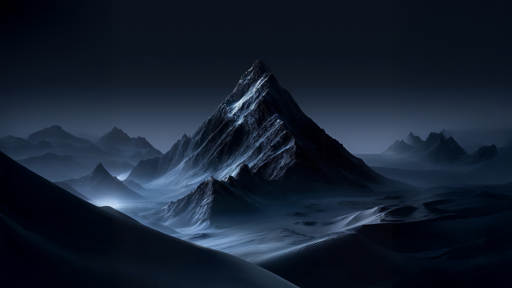

# Mountain Landscape

A dark mountain landscape theme for Omarchy — near-black blue backgrounds, soft
slate-blue accents and icy cyan highlights.



> A copy of [Davedes83's Mountain Landscape](https://github.com/Davedes83/omarchy-mountain-landscape-theme),
> re-exported as an installable repo. Not original work — see [Credits and license](#credits-and-license).

## Install

```bash
omarchy theme install https://github.com/ElChacoVeloz/omarchy-mountain-landscape-theme
```

The install command clones the theme into `~/.config/omarchy/themes/mountain-landscape`
and applies it right away. To re-apply later:

```bash
omarchy theme set "Mountain Landscape"
```

## Colors

Mode: `dark`

| Role               | Hex       |
| ------------------ | --------- |
| Accent             | `#7aa2f7` |
| Selection          | `#31323c` |
| Muted              | `#414868` |
| Background         | `#1a1b26` |
| Dark background    | `#14141d` |
| Darker background  | `#0d0e13` |
| Lighter background | `#31323c` |
| Foreground         | `#a9b1d6` |
| Dark foreground    | `#7f85a1` |
| Light foreground   | `#b6bddc` |
| Bright foreground  | `#bfc5e0` |
| Red                | `#f7768e` |
| Yellow             | `#e0af68` |
| Orange             | `#f88b9f` |
| Green              | `#9ece6a` |
| Cyan               | `#7dcfff` |
| Blue               | `#7aa2f7` |
| Magenta            | `#bb9af7` |
| Brown              | `#95535f` |
| Bright red         | `#f7768e` |
| Bright yellow      | `#e0af68` |
| Bright green       | `#9ece6a` |
| Bright cyan        | `#7dcfff` |
| Bright blue        | `#7aa2f7` |
| Bright magenta     | `#bb9af7` |

## Backgrounds

Four wallpapers ship with the theme; cycle them with `omarchy theme bg next`.

- `backgrounds/mountain-landscape.jpg` (default)
- `backgrounds/moon-mountains-3840x2160-11338.jpg`
- `backgrounds/vestrahorn-mountain-stokksnes-beach-icelandic-coast-snow-3840x2160-1327.jpg`
- `backgrounds/antarctica-mountain-range-glacier-snow-covered-night-sky-3840x2160-6398.png`

Extra wallpapers for this theme only can be dropped into
`~/.config/omarchy/backgrounds/mountain-landscape/`.

## Files

Source files that make the theme:

- `colors.toml` — the palette. Everything else is derived from it.
- `icons.theme` — icon theme (`Yaru-blue`).
- `backgrounds/` — wallpapers.
- `shell.toml` — Omarchy shell (bar) styling.
- `vscode-theme.json` — VS Code color theme.

App configs generated from `colors.toml` by Omarchy (`btop.theme`,
`chromium.theme`, `claude.json`, `helix.toml`, `hermes.yaml`,
`hyprland-preview-share-picker.css`, `keyboard.rgb`, `obsidian.css`, `pi.json`,
`t3code.json`) are committed here as a snapshot of the applied theme. Omarchy
regenerates them from `colors.toml` on install, so editing them has no lasting
effect — edit `colors.toml` instead.

Omarchy refuses to run code shipped by a theme installed from a git repo, so
`.lua` files (`hyprland.lua`, `gum_env.lua`, `neovim.lua`) and the terminal
configs (`alacritty.toml`, `foot.ini`, `ghostty.conf`, `kitty.conf`,
`vscode.json`) are not part of this repository; they are generated locally from
`colors.toml` when the theme is applied.

## Credits and license

**Mountain Landscape** is the work of
[Davedes83](https://github.com/Davedes83/omarchy-mountain-landscape-theme).
This repository is a copy of that theme, re-exported from an installed Omarchy
system so it can also be installed from here.

The upstream project ships **no license file**, so no license is granted for its
contents: the palette, the wallpapers, `icons.theme` and everything derived from
`colors.toml` belong to their authors, and this repository grants no rights to
them beyond what GitHub's own terms already allow for public repositories
(viewing and forking on GitHub). The wallpapers in particular are third-party
images and may carry terms of their own.

The only work original to this repository is the README and the export itself;
there is nothing here to place under MIT or any other license. If you want to
reuse the theme outside GitHub, ask the original author first. If a license
appears upstream, this notice will be updated to match it.
